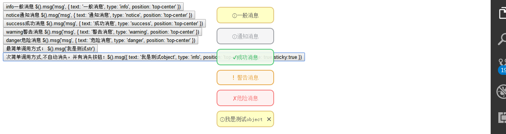

### 基于jquery的提示框JavaScript 插件，类Bootstrap

[TOC]
#### 源码
github地址：
[https://github.com/Ethan-Xie/message](https://github.com/Ethan-Xie/message)
#### 实例
通过此此插件可以为提示栏添加自动/点击消失的功能

#### 用法
> 需引入message.css与message.js

为元素加上`onclick="$.fn.msg('msg', { text: '警告消息', type: 'warning', position: ' middle-center' })"`事件函数，可以自动为元素添加点击后，可以全局添加提示框功能，可以多次添加。如配置为了手动关闭，提示框会出现×字符，点击会将其从DOM中删除
```

<button type="button"  onclick="$.fn.msg('msg', { text: '警告消息', type: 'warning', position: ' middle-center' })">
warning警告消息 $.fn.msg('msg', { text: '警告消息', type: 'warning', position: 'top-center' })
</button>
```


#### 方法
`$.fn.msg或者$().msg`
让元素具有提示框功能，如果再传入配置
sticky:true代表不会自动消失， close:true代表提示信息后面会自动添加“×”删除字符
- 其它可以传入配置：

```
inEffect: {opacity: 'show'}, // 实现方式
inEffectDuration: 200, // 出现过渡时间
stayTime: 1000, //信息停留时间
leaveTime: 600, // 信息离开动画时间
text: '', // 提示内容
sticky: false, // 内容是否常驻界面
type: 'info', //类型：notice, warning, danger, success,info
position: 'top-center', //// top-left, top-center, top-right, middle-left, middle-center, middle-right
close: false, // 是否开启开关功能
closeText: '✖', //关闭的文字

```

#### 示例
- 函数概述：

```

axiecc@gmail.com create by xiethan on 19.12.17
* $().msg(str|object, [object])
* 概述： 方法可以调用网页一个提示框, 依赖于jquery
* 参数：str: 提示框显示的文字，样式等设置为默认值
* object：一个设置集合对象：如：{ text: '我是测试object', type: 'info', position: 'top-center' }，其它可以参数在文中上一段代码
* str,[object]:str为调用库的哪个(msg|removemsg)方法，object:与上一致

```
- 示例
```

最简单调用方式： $.fn.msg('我是测试str')
次简单调用方式,不自动消失，并有关闭按钮：$.fn.msg({ text: '我是测试object', type: 'info', position: 'top-center',close: true,sticky:true })
info一般消息 $.fn.msg('msg', { text: '一般消息', type: 'info', position: 'top-center' })
notice通知消息 $.fn.msg('msg', { text: '通知消息', type: 'notice', position: 'top-center' })
success成功消息 $.fn.msg('msg', { text: '成功消息', type: 'success', position: 'top-center' })
warning警告消息 $.fn.msg('msg', { text: '警告消息', type: 'warning', position: 'top-center' })
danger危险消息 $.fn.msg('msg', { text: '危险消息', type: 'danger', position: 'top-center' })


```
#### IE兼容性
引入jquery<2.0下:支持>=IE8

#### 源码解析
请阅读 [源码解析](./src/message.js)
